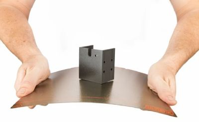

# Bed Types

## Glass

- Durable

- Affordable

- Can be difficult to remove prints

## Ceramic Coated Glass

- Can be difficult to remove prints

## Magnetic Sheet

- Flexible

- Easily removed for cleaning

- Doesn't last very long

---

## PEI Springsteel 

Our recommended bed type, preferably get one that is powder coated.

- Durable

- Magnetic

- Bends to release prints

- Lightly clean after each print with rubbing alcohol
