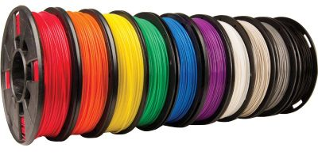

# Types of Filament

## PLA

The most common filament bath bomb mold makers use.

Common in 3D printing because it is easy to use and yet durable enough for making bath bombs.

However, PLA is sensitive to heat and so should not be put in the dishwasher, left outdoors, in a hot car, etc...

## PLA+

There is no standard for what the plus means, but usually this is a higher quality or more durable version of the PLA offered by that manufacturer.

Still sensitive to heat, in most instances.

## PETG

A more durable and heat resistant plastic. 

However it also is more expensive and more difficult to use than PLA and is prone to stringing.

PETG also needs to be kept dry and is prone to becoming brittle and even more difficult to print with if left in humid environments.

## TPU

A flexible plastic used for parts that should bend.

More difficult than PLA to print with and generally requires a direct drive hotend setup and fine tuning to print properly.