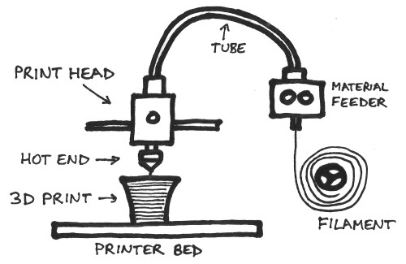
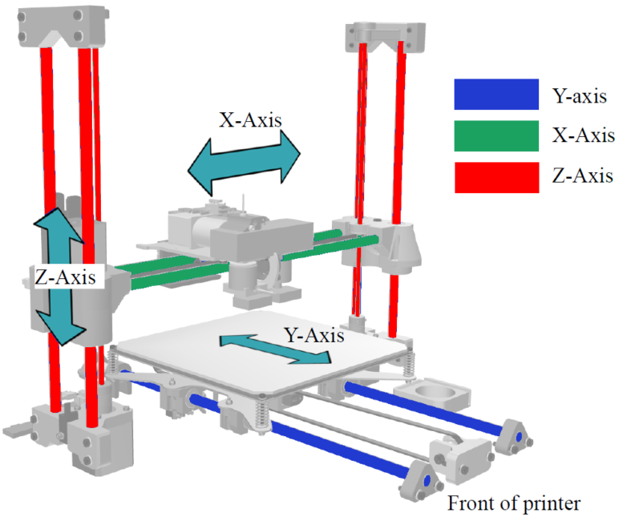
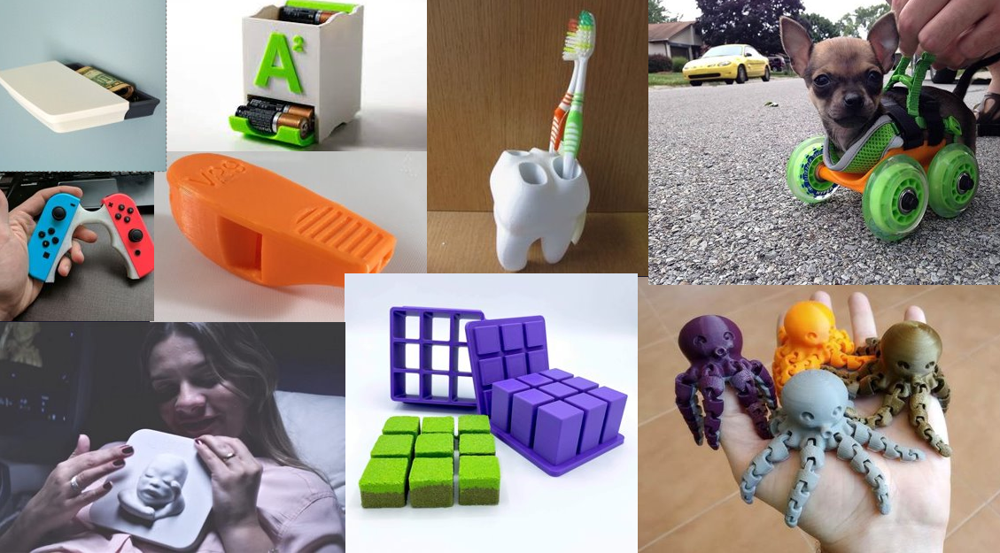

# What is a 3D Printer (FDM)?

Basically, a 3D printer pours melted plastic out in lines that stack on top of each other, to form a desired shape.

A spool of plastic material called filament is pushed through a tube then heated in a hotend which extrudes hot plastic:

---

While pushing plastic out, the printer can move in three directions:

---

This combination of movement and plastic extrusion allows a 3D printer to create all sorts of objects:

