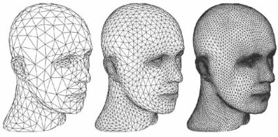
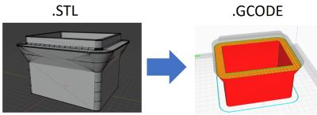

# STL Files

When you go online to find things to print, they will download as `.STL` (or sometimes `.3MF`) files. 

STL files are basically a bunch of triangles that describe how an object looks:

To print these models, they must first be converted into something your 3D printer can use. 

For that, we have:

# Slicers

A slicer is a program that converts STL files into GCODE files, which your 3D printer can use.

After it's been converted to a GCODE file, you can then have your 3D printer print that file.

The two main slicers people use are:

- [PrusaSlicer](https://www.prusa3d.com/page/prusaslicer_424/)
- [Cura](https://ultimaker.com/software/ultimaker-cura)

